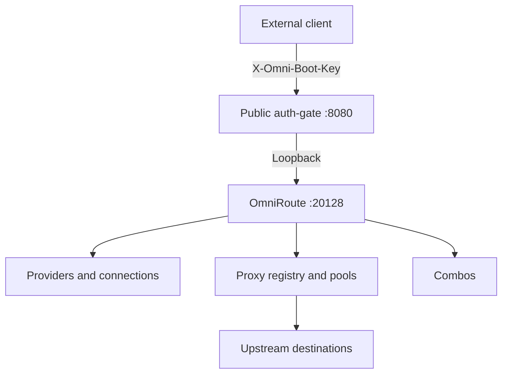

<div align="center">

# omni-boot

**Ephemeral Node.js bootstrapper for configuring OmniRoute 3.8.49 and publishing an authenticated API proxy.**

[](https://nodejs.org/)
[](https://www.typescriptlang.org/)
[](https://www.npmjs.com/package/omniroute)
[](#auth-gate-and-streaming)

**[Français](README.md) · English**

</div>

`omni-boot` is a runtime designed for ephemeral OmniRoute deployments. It turns versioned configuration into OmniRoute resources, creates providers and their connections from injected keys, configures proxies and combos, and then publishes a transparent `auth-gate`.

The project is intentionally stateless: created IDs, the session cookie, and OmniRoute’s initial password remain in memory and disappear with the container.

## Why omni-boot exists

OmniRoute provides the execution engine. `omni-boot` provides the deterministic bootstrap around that engine:

- validation before remote state changes;
- explicit creation ordering;
- provider/model and combo reference resolution;
- reproducible connection creation for every key;
- declarative proxy pool configuration;
- separation between the local control plane and the public entry point;
- transparent HTTP forwarding for request bodies and streaming responses.

## Architecture



At startup, the container launches OmniRoute, waits for `GET /api/health/ping`, logs in locally using an in-memory secret, runs the bootstrap, and opens the public port only after these steps succeed.

## Features

- Bootstrap of providers, connections, proxies, and combos.
- Versioned JSON DSL under `config/providers/` and `config/combos/`.
- One OmniRoute connection for each entry in a `*_KEYS` variable.
- `provider/model` references, including models containing additional `/` characters.
- Combo references translated into native `combo-ref` steps.
- `http`, `https`, and `socks5` proxy registry and assignments.
- Pool assignment by `global`, `provider`, `account`, and `combo` scopes according to runtime capabilities.
- Pool strategies delegated to OmniRoute.
- `auth-gate` with constant-time secret comparison.
- Body, useful-header, and stream forwarding without full buffering.
- Explicit Node trust store for the required public certificate authorities.
- Automatic generation of OmniRoute’s internal password.
- Configurable startup and readiness timeout.

## Local installation

Requirements: Node.js 22 or later, npm, and an `omniroute` command available locally.

```bash
npm ci
npm run build
```

Start the runtime:

```bash
export OMNI_BOOT_API_KEY='replace-with-a-long-random-client-secret'
export CUSTOM_PROVIDER_KEYS='["provider-key-1","provider-key-2"]'
export PROXY_FAIL_OPEN='false'
export OMNIROUTE_CONTROL_PLANE_PROXY_DIRECT_FALLBACK='false'
npm start
```

The public entry listens on `0.0.0.0:8080` by default. OmniRoute remains on `127.0.0.1:20128`.

## Provider configuration

Each `config/providers/*.json` file describes a provider:

```json
{
  "name": "custom-provider",
  "type": "openai-compatible",
  "baseUrl": "https://api.example.com/v1",
  "apiKeys": "CUSTOM_PROVIDER_KEYS",
  "models": ["model-a", "model-b", "openai/gpt-5.6-luna"],
  "defaultModel": "model-a"
}
```

`apiKeys` contains the name of an environment variable. That variable must contain a non-empty JSON array of non-empty strings:

```bash
export CUSTOM_PROVIDER_KEYS='["key-a","key-b","key-c"]'
```

omni-boot creates a separate connection for every key. Keys are never written to generated configuration files.

The `models` list documents the models known to the configuration; it does not manufacture a complete catalog. References are split at the first `/`:

```text
my-router/openai/gpt-5.6-luna
provider = my-router
model    = openai/gpt-5.6-luna
```

## Combo configuration

Each combo is defined in `config/combos/*.json`:

```json
{
  "name": "coding",
  "strategy": "priority",
  "targets": {
    "models": ["custom-provider/model-a"],
    "combos": ["fallback-combo"]
  }
}
```

The bootstrapper translates `targets.models` into `kind: "model"` steps and `targets.combos` into `kind: "combo-ref"` steps. Selection, fallback, and rotation remain responsibilities of the OmniRoute engine.

## Proxy configuration

`PROXY_SETTINGS` is a JSON object containing a registry and assignments:

```json
{
  "registry": [
    {
      "id": "edge-proxy",
      "type": "https",
      "host": "proxy.example.net",
      "port": 8080,
      "username": "proxy-user",
      "password": "proxy-password"
    }
  ],
  "assignments": [
    {
      "scope": "global",
      "scopeId": null,
      "proxyIds": ["edge-proxy"],
      "strategy": "round-robin"
    }
  ]
}
```

The registry creates each proxy through the OmniRoute API and keeps a mapping between logical and runtime IDs. Assignments add proxies to pools and configure the native strategy. omni-boot does not implement rotation in its own code.

The `https` type means a TLS connection to the proxy listener. The client must trust the appropriate public certificate in its trust store.

## Environment variables

Essential variables:

| Variable | Required | Default | Description |
| --- | --- | --- | --- |
| `OMNI_BOOT_API_KEY` | Yes | — | Secret for the `X-Omni-Boot-Key` header. |
| `*_KEYS` | Per provider | — | JSON key array referenced by provider files. |
| `PROXY_SETTINGS` | When proxies are used | — | JSON registry and assignments. |
| `PROXY_FAIL_OPEN` | Recommended | `false` | Whether direct egress is allowed when a proxy fails. |
| `OMNIROUTE_CONTROL_PLANE_PROXY_DIRECT_FALLBACK` | Recommended | `false` | Direct fallback for control-plane flows. |
| `OMNIROUTE_PORT` | No | `20128` | OmniRoute loopback port. |
| `AUTH_GATE_PORT` | No | `8080` | Public auth-gate port. |
| `OMNIROUTE_URL` | No | `http://127.0.0.1:20128` | Control-plane loopback URL. |
| `OMNIROUTE_COMMAND` | No | `omniroute` | Command used to start OmniRoute. |
| `OMNIROUTE_READY_TIMEOUT_MS` | No | `60000` | Readiness timeout in milliseconds. |
| `OMNI_BOOT_CONFIG` | No | `.` | Root directory containing `config/`. |

The complete reference is in [`DEPLOYMENT_ENV.md`](DEPLOYMENT_ENV.md).

## TLS trust store

The image builds a public bundle containing the certificate authorities required for TLS connections:

```text
certs/Flaretunnel-MITM-CA.crt
certs/Flaretunnel-TRANSPORT-CA.crt
certs/omni-trust-bundle.pem
```

`NODE_EXTRA_CA_CERTS` points to `omni-trust-bundle.pem`. The image contains no CA private key and omni-boot receives none.

Never disable TLS validation with `rejectUnauthorized: false` or `NODE_TLS_REJECT_UNAUTHORIZED=0`. Test specialized TLS modes separately when they use a network client different from the standard path.

## Auth-gate and streaming

The public client must send:

```http
X-Omni-Boot-Key: value-of-OMNI_BOOT_API_KEY
```

The header is validated before forwarding and removed from the request sent to OmniRoute. A missing or invalid value receives `401 Unauthorized`.

The gate forwards the body using Node.js native backpressure. It does not log request bodies, parse SSE events, or buffer the complete response. Provider headers and long LLM responses remain compatible with streaming.

Initial reception has slowloris protection: 60 seconds for headers and 120 seconds for the request body. Socket timeouts remain disabled during active SSE responses.

## Startup lifecycle

1. start OmniRoute;
2. wait for `GET /api/health/ping`;
3. load and validate providers and combos;
4. generate `INITIAL_PASSWORD` in memory;
5. log in locally and retain only the session cookie;
6. create provider nodes;
7. create one connection per provider key;
8. create the proxy registry and pools;
9. resolve references and create combos;
10. start the public auth-gate.

If a step fails, bootstrapping stops without publishing the public entry point.

## Docker

The `Dockerfile` explicitly installs OmniRoute `3.8.49`, compiles omni-boot, copies `config/`, and exposes only the public port:

```bash
docker build -t omni-boot:3.8.49 .
docker run --rm -p 8080:8080 \
  -e OMNI_BOOT_API_KEY='replace-with-a-long-random-client-secret' \
  -e CUSTOM_PROVIDER_KEYS='["provider-key-1","provider-key-2"]' \
  -e PROXY_FAIL_OPEN='false' \
  -e OMNIROUTE_CONTROL_PLANE_PROXY_DIRECT_FALLBACK='false' \
  omni-boot:3.8.49
```

Do not publish port `20128` directly. Inject secrets through the deployment environment.

## Project structure

```text
src/schemas/       DSL schemas and validation
src/bootstrap/     Orchestration and creation order
src/adapters/      OmniRoute API adapter
src/authgate/      Authentication and transparent forwarding
config/providers/  Versioned providers
config/combos/     Versioned combos
certs/             Public certificates only
Dockerfile         OmniRoute + omni-boot image
DEPLOYMENT_ENV.md  Environment reference
```

## Tests

```bash
npm ci
npm test
npm run build
git diff --check
```

The suite covers provider/combo/proxy DSL validation, `*_KEYS` arrays, multiple connections, references containing `/`, combo dependencies, readiness checks, auth-gate behavior, header removal, and streaming.

## Operational security

Use a long, random `OMNI_BOOT_API_KEY`. Do not commit provider credentials, proxy passwords, or real `.env` files. Keep both fallback variables set to `false` whenever direct egress is forbidden.

The internal OmniRoute password is generated on every start, passed only to the child process, and never displayed. The session cookie remains in memory only.

## License and responsibility

Review the repository and dependency licenses. Operators are responsible for secrets, configured destinations, network permissions, and provider usage.

## References

- [Node.js documentation](https://nodejs.org/docs/latest/api/ "Node.js documentation")
- [TypeScript documentation](https://www.typescriptlang.org/docs/ "TypeScript documentation")
- [OmniRoute documentation](https://www.npmjs.com/package/omniroute "OmniRoute package")
- [Node.js TLS API](https://nodejs.org/api/tls.html "Node.js TLS API")

---

[Lire cette documentation en français](README.md)
