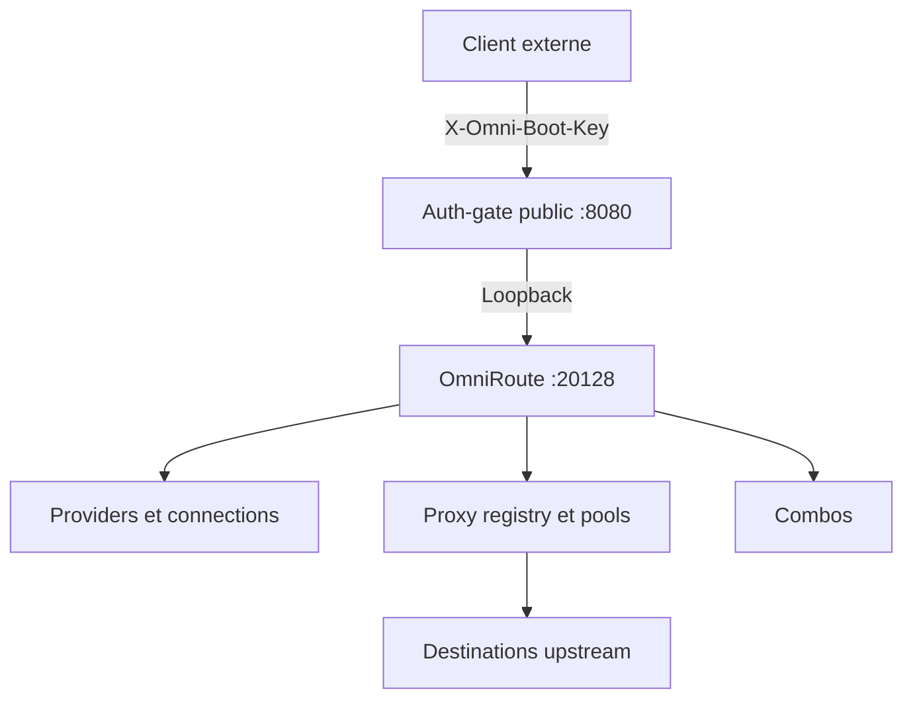

<div align="center">

# omni-boot

**Bootstrapper Node.js éphémère pour configurer OmniRoute 3.8.49 et publier un proxy API authentifié.**

[](https://nodejs.org/)
[](https://www.typescriptlang.org/)
[](https://www.npmjs.com/package/omniroute)
[](#auth-gate-et-streaming)

**Français · [English](README.en.md)**

</div>

`omni-boot` est un runtime de démarrage conçu pour les déploiements éphémères d’OmniRoute. Il transforme un DSL versionné en ressources OmniRoute, crée les providers et leurs connections à partir des clés injectées, configure les proxies et les combos, puis publie un `auth-gate` transparent.

Le projet est volontairement sans état durable : les IDs créés, le cookie de session et le mot de passe initial d’OmniRoute restent en mémoire et disparaissent avec le conteneur.

## Pourquoi omni-boot existe

OmniRoute fournit le moteur d’exécution. `omni-boot` fournit le bootstrap déterministe autour de ce moteur :

- validation avant modification de l’état distant ;
- ordre de création explicite ;
- résolution des références provider/model et combo ;
- création reproductible des connections pour chaque clé ;
- configuration déclarative des pools proxy ;
- séparation entre le control plane local et l’entrée publique ;
- relais HTTP transparent pour les bodies et les réponses streaming.

## Architecture



Au démarrage, le conteneur lance OmniRoute, attend `GET /api/health/ping`, effectue le login local avec un secret généré en mémoire, exécute le bootstrap et n’ouvre le port public qu’après la réussite de ces étapes.

## Fonctionnalités

- Bootstrap de providers, connections, proxies et combos.
- DSL JSON versionné sous `config/providers/` et `config/combos/`.
- Une connection OmniRoute par entrée d’une variable `*_KEYS`.
- Références de modèles `provider/model`, y compris lorsqu’un modèle contient d’autres `/`.
- Références de combos traduites en étapes natives `combo-ref`.
- Registry de proxies `http`, `https` et `socks5`.
- Assignation par scopes `global`, `provider`, `account` et `combo` selon les capacités du runtime.
- Stratégies de pool déléguées à OmniRoute.
- `auth-gate` avec comparaison constante du secret.
- Relais du body, des headers utiles et des streams sans buffering complet.
- Trust store Node explicite pour les autorités de certification publiques requises.
- Génération automatique du mot de passe interne OmniRoute.
- Démarrage configurable et health-check avec timeout de readiness.

## Installation locale

Pré-requis : Node.js 22 ou version ultérieure, npm et une commande `omniroute` disponible localement.

```bash
npm ci
npm run build
```

Pour démarrer le runtime :

```bash
export OMNI_BOOT_API_KEY='replace-with-a-long-random-client-secret'
export CUSTOM_PROVIDER_KEYS='["provider-key-1","provider-key-2"]'
export PROXY_FAIL_OPEN='false'
export OMNIROUTE_CONTROL_PLANE_PROXY_DIRECT_FALLBACK='false'
npm start
```

L’entrée publique écoute par défaut sur `0.0.0.0:8080`. OmniRoute reste sur `127.0.0.1:20128`.

## Configuration des providers

Chaque fichier `config/providers/*.json` décrit un provider :

```json
{
  "name": "custom-provider",
  "type": "openai-compatible",
  "baseUrl": "https://api.example.com/v1",
  "apiKeys": "CUSTOM_PROVIDER_KEYS",
  "models": ["model-a", "model-b", "openai/gpt-5.6-luna"],
  "defaultModel": "model-a"
}
```

`apiKeys` contient le nom d’une variable d’environnement. Cette variable doit contenir un tableau JSON non vide de chaînes non vides :

```bash
export CUSTOM_PROVIDER_KEYS='["key-a","key-b","key-c"]'
```

omni-boot crée alors une connection distincte pour chaque clé. Les clés ne sont jamais écrites dans les fichiers de configuration générés.

Les modèles décrits par `models` documentent la configuration ; ils ne créent pas artificiellement un catalogue complet. Une référence est découpée au premier `/` :

```text
my-router/openai/gpt-5.6-luna
provider = my-router
model    = openai/gpt-5.6-luna
```

## Configuration des combos

Chaque combo est défini dans `config/combos/*.json` :

```json
{
  "name": "coding",
  "strategy": "priority",
  "targets": {
    "models": ["custom-provider/model-a"],
    "combos": ["fallback-combo"]
  }
}
```

Le bootstrapper traduit `targets.models` en étapes `kind: "model"` et `targets.combos` en étapes `kind: "combo-ref"`. La sélection, le fallback et la rotation restent des responsabilités du moteur OmniRoute.

## Configuration des proxies

`PROXY_SETTINGS` est un objet JSON composé d’un registry et d’assignments :

```json
{
  "registry": [
    {
      "id": "edge-proxy",
      "type": "https",
      "host": "proxy.example.net",
      "port": 8080,
      "username": "proxy-user",
      "password": "proxy-password"
    }
  ],
  "assignments": [
    {
      "scope": "global",
      "scopeId": null,
      "proxyIds": ["edge-proxy"],
      "strategy": "round-robin"
    }
  ]
}
```

Le registry crée chaque proxy via l’API OmniRoute et conserve une correspondance entre les IDs logiques et les IDs runtime. Les assignments ajoutent les proxies aux pools puis configurent la stratégie native. omni-boot ne fait pas la rotation dans son propre code.

Le type `https` désigne une connexion TLS vers le listener proxy. Le client doit faire confiance au certificat public approprié dans son trust store.

## Variables d’environnement

Variables essentielles :

| Variable | Requis | Défaut | Description |
| --- | --- | --- | --- |
| `OMNI_BOOT_API_KEY` | Oui | — | Secret du header `X-Omni-Boot-Key`. |
| `*_KEYS` | Selon les providers | — | Tableau JSON de clés référencé par les fichiers provider. |
| `PROXY_SETTINGS` | Si proxy utilisé | — | Registry et assignments JSON. |
| `PROXY_FAIL_OPEN` | Recommandé | `false` | Autorise ou non une sortie directe si le proxy échoue. |
| `OMNIROUTE_CONTROL_PLANE_PROXY_DIRECT_FALLBACK` | Recommandé | `false` | Fallback direct des flux control plane. |
| `OMNIROUTE_PORT` | Non | `20128` | Port loopback OmniRoute. |
| `AUTH_GATE_PORT` | Non | `8080` | Port public auth-gate. |
| `OMNIROUTE_URL` | Non | `http://127.0.0.1:20128` | URL loopback du control plane. |
| `OMNIROUTE_COMMAND` | Non | `omniroute` | Commande lancée pour OmniRoute. |
| `OMNIROUTE_READY_TIMEOUT_MS` | Non | `60000` | Timeout du health-check en millisecondes. |
| `OMNI_BOOT_CONFIG` | Non | `.` | Racine des dossiers `config/`. |

La référence complète se trouve dans [`DEPLOYMENT_ENV.md`](DEPLOYMENT_ENV.md).

## Trust store TLS

L’image construit un bundle public contenant les CA nécessaires aux connexions TLS :

```text
certs/Flaretunnel-MITM-CA.crt
certs/Flaretunnel-TRANSPORT-CA.crt
certs/omni-trust-bundle.pem
```

`NODE_EXTRA_CA_CERTS` pointe vers `omni-trust-bundle.pem`. L’image ne contient aucune clé privée de CA et omni-boot n’en reçoit pas.

Ne désactivez jamais la validation TLS avec `rejectUnauthorized: false` ou `NODE_TLS_REJECT_UNAUTHORIZED=0`. Testez séparément les modes TLS spécialisés qui utilisent un client réseau différent du chemin standard.

## Auth-gate et streaming

Le client public doit envoyer :

```http
X-Omni-Boot-Key: valeur-de-OMNI_BOOT_API_KEY
```

Le header est validé avant forwarding puis retiré de la requête envoyée à OmniRoute. Une valeur absente ou incorrecte reçoit `401 Unauthorized`.

Le gate relaie le body avec la backpressure native de Node.js. Il ne journalise pas le body, ne parse pas les événements SSE et ne bufferise pas la réponse complète. Les headers de providers et les réponses LLM longues restent compatibles avec le streaming.

La réception initiale possède des limites anti-slowloris : 60 secondes pour les headers et 120 secondes pour le body de requête. Les timeouts de socket restent désactivés pendant une réponse SSE active.

## Cycle de démarrage

1. lancer OmniRoute ;
2. attendre `GET /api/health/ping` ;
3. charger et valider les providers et les combos ;
4. générer `INITIAL_PASSWORD` en mémoire ;
5. effectuer le login local et conserver uniquement le cookie de session ;
6. créer les provider nodes ;
7. créer une connection par clé provider ;
8. créer le registry et les pools proxy ;
9. résoudre les références et créer les combos ;
10. démarrer l’auth-gate public.

En cas d’erreur, le bootstrap échoue sans publier l’entrée publique.

## Docker

Le `Dockerfile` installe explicitement OmniRoute `3.8.49`, compile omni-boot, copie `config/` et expose uniquement le port public :

```bash
docker build -t omni-boot:3.8.49 .
docker run --rm -p 8080:8080 \
  -e OMNI_BOOT_API_KEY='replace-with-a-long-random-client-secret' \
  -e CUSTOM_PROVIDER_KEYS='["provider-key-1","provider-key-2"]' \
  -e PROXY_FAIL_OPEN='false' \
  -e OMNIROUTE_CONTROL_PLANE_PROXY_DIRECT_FALLBACK='false' \
  omni-boot:3.8.49
```

Ne publiez pas directement le port `20128`. Les secrets doivent être injectés par l’environnement du déploiement.

## Structure du projet

```text
src/schemas/       Schémas et validation du DSL
src/bootstrap/     Orchestration et ordre de création
src/adapters/      Adaptateur de l’API OmniRoute
src/authgate/      Authentification et forwarding transparent
config/providers/  Providers versionnés
config/combos/     Combos versionnés
certs/             Certificats publics uniquement
Dockerfile         Image OmniRoute + runtime omni-boot
DEPLOYMENT_ENV.md  Référence des variables
```

## Tests

```bash
npm ci
npm test
npm run build
git diff --check
```

La suite couvre le DSL provider/combo/proxy, les tableaux `*_KEYS`, la création de plusieurs connections, les références contenant `/`, les combos, le health-check, l’auth-gate, la suppression du header et le streaming.

## Sécurité opérationnelle

Utilisez une valeur `OMNI_BOOT_API_KEY` longue et aléatoire. Ne committez aucun credential provider, mot de passe proxy ou fichier `.env` réel. Conservez les deux variables de fallback à `false` lorsque le trafic ne doit jamais sortir directement.

Le mot de passe interne OmniRoute est généré à chaque démarrage, transmis uniquement au processus enfant et jamais affiché. Le cookie de session est conservé uniquement en mémoire.

## Licence et responsabilité

Consultez les licences du dépôt et de ses dépendances. L’opérateur est responsable des secrets, des destinations configurées, des permissions réseau et de l’utilisation des providers.

## Références

- [Documentation Node.js](https://nodejs.org/docs/latest/api/ "Node.js documentation")
- [Documentation TypeScript](https://www.typescriptlang.org/docs/ "TypeScript documentation")
- [Documentation OmniRoute](https://www.npmjs.com/package/omniroute "OmniRoute package")
- [Documentation Node.js TLS](https://nodejs.org/api/tls.html "Node.js TLS API")

---

[Lire cette documentation en anglais](README.en.md)
